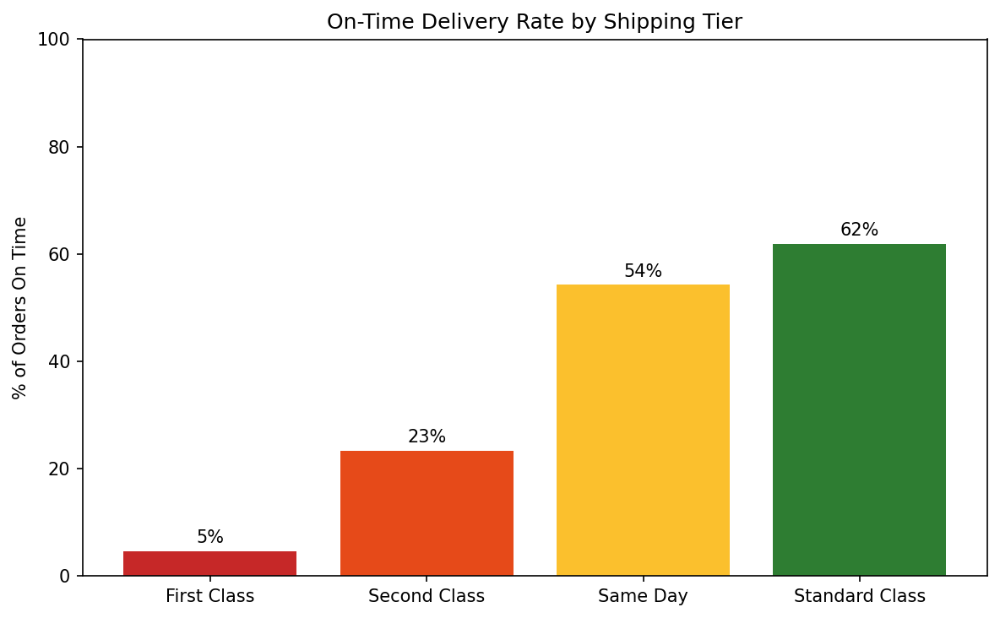
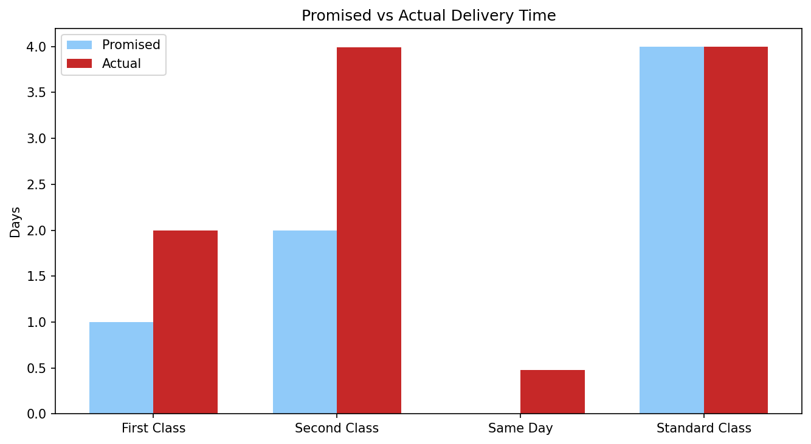
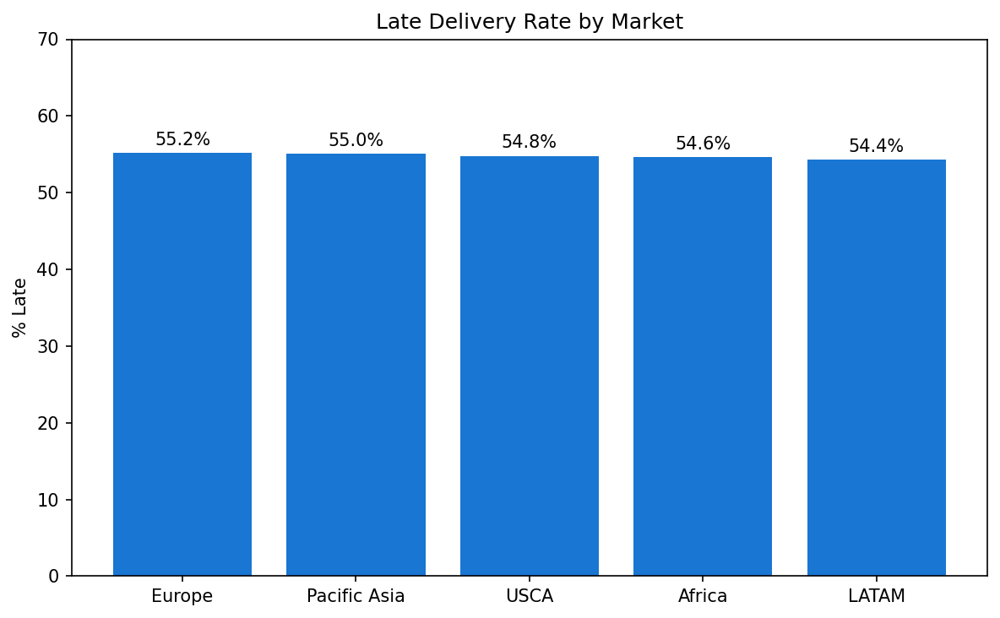
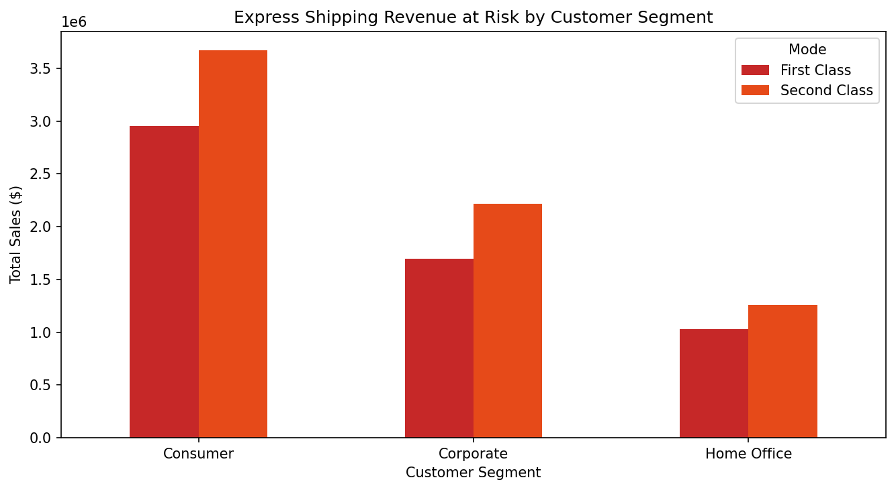
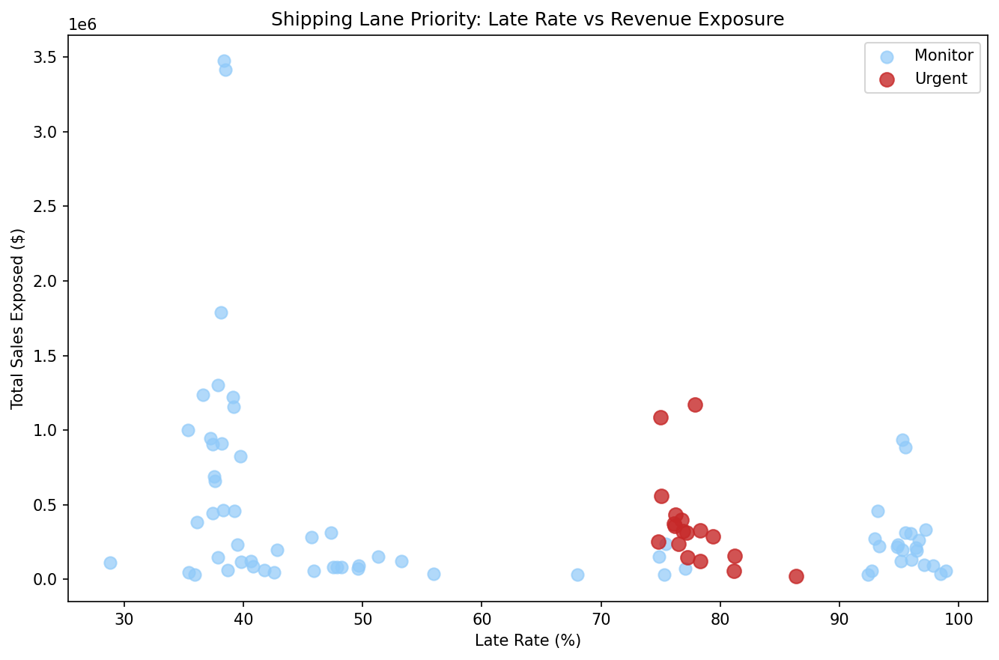
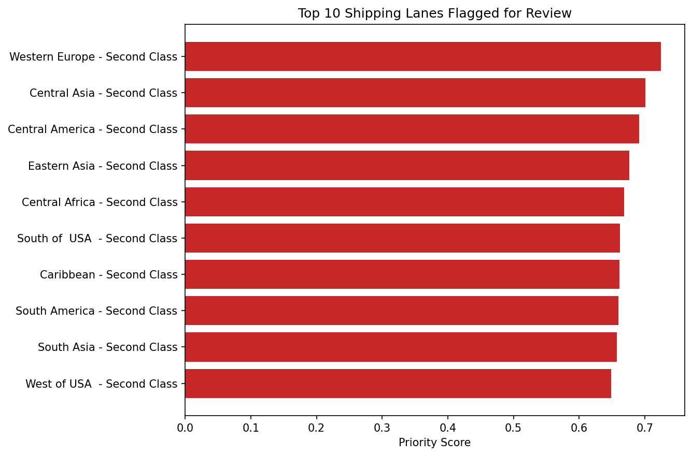

# Supply Chain SLA & Operational Risk Analysis

Independent analysis of delivery performance across a global e-commerce fulfillment network, where the shipping promises break down, why, and which lanes cost the most.

> Dataset: DataCo Global Supply Chain (public, Kaggle). Not affiliated with any company.

---

## Background

54.8% of 180,519 orders arrived late. A coin-flip late rate across a whole network usually points to one of two things: either demand is outrunning capacity everywhere, or the delivery promises themselves are miscalibrated. This analysis is an attempt to tell those two apart, because the fix is completely different depending on which one it is.

The interesting result is that it's the second one, and the data is unusually clean about saying so.

---

## What the data actually shows

Splitting the late rate by shipping tier inverts the intuition. The tiers customers pay a premium for are the ones that fail:

| Tier | Promised | Actual | On-time | Slip |
|---|---|---|---|---|
| First Class | 1 day | 2.0 days | 5% | +1.0 |
| Second Class | 2 days | 4.0 days | 23% | +2.0 |
| Same Day | 0 days | 0.5 days | 54% | +0.5 |
| Standard Class | 4 days | 4.0 days | 62% | -0.0 |

The number that matters here isn't the late rate, it's the slip column, and specifically how stable it is. First Class doesn't miss randomly. It misses by almost exactly one day, in every region, every time. Second Class misses by almost exactly two. Standard Class, the cheapest tier, hits its promise dead on.

That pattern rules out the "carrier is unreliable" story. Unreliable carriers produce variable slip, sometimes 0, sometimes 3. What you see here is a constant offset, which is the signature of a promise set one notch too aggressive for a network that physically runs slower. The express tiers aren't failing to execute. They're executing fine against a number that was never achievable.

This is why the distinction matters operationally: you don't fix a miscalibrated promise by pushing the warehouse harder. You fix it by either moving the promise or rebuilding the lane.

---

## Is the pattern real or noise

Chi-square test of independence between shipping mode and late delivery: χ² = 37,716, p ≈ 0, df = 3. The dependence is about as strong as this test gets. Late delivery is not distributed randomly across tiers, the tier you pick effectively determines whether you're late.

I used chi-square specifically because both variables are categorical (shipping tier, late vs on-time), which is exactly what the test is built for. A t-test on profit, which I tried first, returned p = 0.11 — no significant profit difference between late and on-time orders. That null result is actually informative: it says the company has already priced delay into its margins. The damage from late delivery isn't margin erosion, it's service credibility. That reframing is what moved the whole analysis away from "lost profit" and toward "broken promises and the revenue exposed to them."

---

## Where it concentrates

The late rate is almost perfectly uniform across the five global markets- Europe 55.2%, Pacific Asia 55.0%, USCA 54.8%, Africa 54.6%, LATAM 54.4%. A 0.8-point spread across four continents.

That uniformity is itself the finding. If this were a logistics or infrastructure problem, you'd expect Africa and LATAM to lag North America and Europe. They don't. The flatness says the failure is baked into the shipping-tier logic that's applied globally, not into any regional operation. You can't fix this market by market — it's a single structural decision affecting the whole network.

---

## What's financially exposed

Profit isn't the right lens (the t-test killed that). Revenue concentration is. The question becomes: how much business is running through the broken tiers, and whose business is it.

Corporate customers have $1.69M flowing through First Class at a 95% late rate and $2.22M through Second Class at 78%. Consumer volume is larger in absolute terms, but Corporate is the account type that churns over reliability and the one worth protecting first. The exposure isn't evenly spread, it concentrates in the express lanes for exactly the customers most sensitive to broken promises.

---

## Prioritization model

A flat "everything is late" list is useless to whoever has to act on it. So each region + shipping-mode lane gets a single priority score built from three normalized inputs:

- Late rate - weight 0.40
- Schedule slip in days - weight 0.35
- Revenue exposure - weight 0.25

The weighting is a deliberate choice, not a default. Operational failure (late rate + slip) carries 75% of the score; revenue carries 25%. The logic: a lane should rise on the list because it's broken, with revenue used to rank among the broken ones - not the other way around. Weighting revenue higher would just surface your biggest lanes regardless of whether they're actually failing.

One consequence worth flagging: this scoring pushes high-volume **Second Class** lanes above **First Class**, even though First Class has the worse late rate. That's intentional. First Class slips by 1 day; Second Class slips by 2. A 2-day miss on a 2-day promise is a 100% overrun and a larger absolute failure than a 1-day miss on a 1-day promise. The model captures operational severity, not just frequency. Western Europe Second Class tops the list - 5,438 orders, 78% late, 2-day slip, $1.17M exposed.

Top 20% of lanes flagged urgent: 17 of 86.

---

## Charts

---

## Recommendation

Two levers, applied per lane based on the diagnosis above.

Where the slip is a constant offset and the lane volume is low, the honest fix is to re-promise. A First Class advertised at 2 days that delivers in 2 beats a 1-day promise delivered in 2, same physical service, but the second one reads as a failure and the first reads as kept. This costs nothing operationally and immediately collapses the late-flag rate.

Where the lane carries serious revenue and the promise is worth defending, the urgent-flagged Second Class lanes - the fix is operational: pull the carrier and routing data for those specific lanes and find the source of the consistent 2-day slip. The scoring output is the work order for which lanes to open first.

The thing not to do is treat the 55% network-wide late rate as a single problem and throw uniform capacity at it. The analysis says it isn't one problem, it's a promise-calibration problem on top of a smaller set of genuinely broken high-value lanes, and those need opposite responses.

---

## Honest limitations

Late delivery is defined by the dataset's own flag against scheduled shipping days, not a real customer-facing SLA contract, so "promise" is inferred. Revenue exposure uses order sales value, not margin or customer lifetime value, a production version would weight by CLV, which would likely push Corporate even higher. The re-promise recommendation assumes customers tolerate a longer stated window; that's a testable assumption, not a proven one. And the dataset is a sporting-goods retailer, the method transfers to any fulfillment network but the specific numbers are bound to this data.

---

## Stack

Python · pandas · scipy · matplotlib · Google Colab
